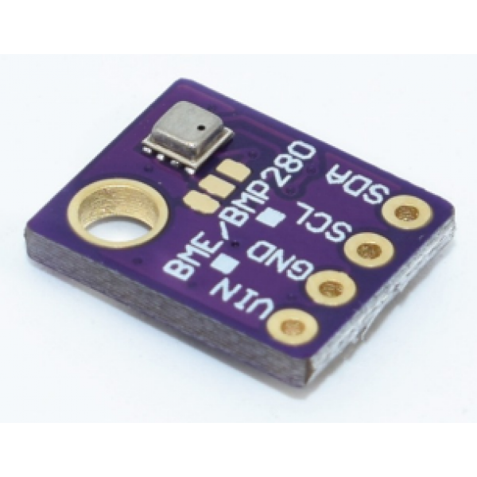

# BME280 Lua driver

A [lua-periphery](https://github.com/vsergeev/lua-periphery) based driver for the Bosch Sensortec BME280 temperature, atmospheric pressure, and humidity sensor.

This is a port of Denis Dyakov's [go-bsbmp](https://github.com/d2r2/go-bsbmp) driver (MIT License), with portions contributed by Iron Heart Consulting LLC.
